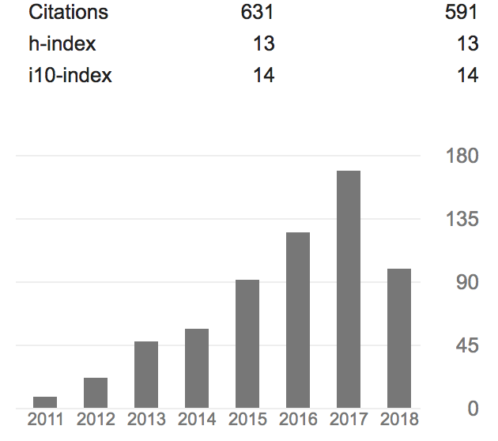

# Ryan Abernathey: Research Statement #

The overall goal of my research is to understand the factors which govern the
large-scale ocean circulation, and resulting transport of heat and tracers, on
timescales relevant for Earth's climate. The ocean components of global climate
models are still relatively coarse and crude compared to their atmospheric
counterparts, limiting our ability to make long term forecasts or study past
climates. My driving principle is that the best way to improve this situation is
through careful, focused studies of unresolved and poorly understood ocean
processes.

## Spatial and Temporal Variability in Mesoscale Turbulence

The ocean mesoscale (roughly 10-300 km), characterized by a turbulent tangle of
eddies, jets, fronts, and filaments, is the most energetic scale in the ocean.
Mixing by mesoscale turbulence represents an
important mechanism for transporting ocean tracers such as heat, carbon, and oxygen.
But due to the small spatial scales involved, much remains unknown about how
mesoscale turbulence varies in space and time through the global ocean.
Shedding light on this variability has been a central focus of my research.

My Ph.D. work _[Abernathey et al., 2010; Abernathey and Marshall, 2013]_,
using a novel method for analyzing satellite observations of sea-surface
height (SSH), showed that mesoscale diffusivity varies regionally over several
orders of magnitude.
Subsequently, we have developed a deeper physical explanation for this
global variability using mixing length theory _[Klocker and Abernathey, 2014]_
and cross spectral analysis of SSH and Sea Surface Temperature (SST)
_[Abernathey and Wortham, 2015]_.
This work led to two research grants from NASA and membership in NASA's Surface
Water and Ocean Topography Science Team SWOT. Our ongoing work (collaborative
with Shafer Smith of NYU) is helping to guide the science goals of this new
satellite, due to launch in 2021.

A fundamental yet largely unexplored problem in physical
oceanography is the question of how the large-scale characteristics of
mesoscale turbulence (such as kinetic energy, eddy size, and mixing rates)
vary on interannual and decadal timescales, and in response to
climate change.
This question is the topic of my NSF CAREER Award,
entitled _Evolution of Ocean Mesoscale Turbulence in a Changing Climate_.
Work on this topic has largely been led by students.
In _Sinha and Abernathey (2016)_, we developed a theoretical model for the
eddy kinetic energy response to time-varying wind forcing.
_Uchida et al. (2017)_ tackled the seasonal cycle in upper-ocean turbulence,
showing that a high-resolution global climate model partially resolved a
previously hypothesized mixed-layer instability mechanism.
_Busecke et al. (2017)_ found strong interannual variability in mesoscale
mixing rates in the subtropical salinity maxima regions, and
_Busecke and Abernathey (2018)_ expanded this approach to reveal large
correlations between mixing rates across the Pacific and ENSO.
These studies show that mesoscale processes are a dynamic part of the climate
system, rather than simply a passive source of diffusion.
Many new future research directions emerge from this insight.

## Mesoscale Lagrangian Coherent Structures

A new direction for my research is the application of
Lagrangian Coherent Structures methods to satellite and model data. These
methods, developed mostly by applied mathematicians working in dynamics systems
theory, have the potential to resolve long-standing debates about the relative
importance of "trapping" versus "stirring" mechanisms in mesoscale transport.
Our group, with our emphasis on software and big data tools, is uniquely poised
to exploit these powerful but computationally demanding techniques.
A recently published paper _[Abernathey and Haller, 2017]_ uses one such
technique applied to satellite data to quantify the trapped material transport
due to coherent vortices across the Pacific basin.
I am particularly proud of this paper because it makes steps towards
reconciling the Eulerian and Lagrangian perspectives on eddy transport, a
fundamental theoretical challenge in fluid mechanics.
With this new technique, we were able to show that trapping makes a negligible
contribution to the total eddy transport, directly challenging several recent
high profile papers.

Having developed the tools for large-scale identification of Lagrangian
Coherent Structures from observational and model data, we are now tackling a
range of new problems.
_[Tarshish et al, 2018]_, a paper by a Princeton post-graduate student which
I was closely involved in supervision, applied this new technique to the
GFDL CM2.6 high-resolution ocean / climate simulation and explored the
parameter sensitivity of the method.
In progress is a follow-up to this work which compares the statistics of eddies
in the simulation with those found in satellite altimetry.

Inspired by the SWOT mission, we are also using the framework of coherent
structures to probe the limits of current generation altiemtry and prepare for
the upcoming next generation. In _[Sinha, Balwada, and Abernathey, 2018]_,
we investigated the role of submesoscales and internal waves in lateral
transport using an extremely high resolution global numerical simulation
(MITgcm LLC4320 1/48-degree), employing time filtering to remove high-frequency
dynamics. This student publication reveals that contemporary altimetry products
likely lead to an overestimation of the degree of mesoscale coherence because
they are missing these fast-timescale motions.

## Southern Ocean Overturning Circulation

In addition to mesoscale dynamics, I maintain a strong regional interest in the
Southern Ocean, which has emerged in recent decades as the central node of the
global ocean overturning system. An NSF-funded collaboration with
colleagues at Scripps Institution of Oceanography (and affiliated with the
large [SOCCOM Project](http://soccom.princeton.edu/)) involved the study of the
thermodynamic processes involved in the upwelling of deep water in the Southern
Ocean.
This work has revealed the relative importance of isopycnal mixing
versus overturning in the response of subduction to changing westerly winds
_[Abernathey and Ferreira, 2015]_.
We have also explored the response of the Southern Ocean to changing climate
in groundbreaking high-resolution coupled climate model simulations
_[Bishop et al., 2016; Newsom et al., 2016]_

Our emphasis on thermodynamic processes is a novel element of our approach.
Work with postdoc Groeskamp showed that cabbelling, an obscure effect due to
the nonlinear equation of state of seawater, likely plays a major role in
the formation of Antarctic Intermediate Water _[Groeskamp et al., 2016]_.
Another exciting discovery was the crucial role of Antarctic sea
ice in maintaining the upper branch of the Southern Ocean overturning
circulation _[Abernathey et al., 2016]_.
We have also recently provided a new description of the three-dimensional
pathways of upwelling using a hybrid Lagrangian / water-mass-transformation
method _[Tasmitt et al., 2018]_.
New work is in progress in collaboration with colleagues as Los Alamos
National Laboratory, applying water mass diagnostics to understand the role
of sea ice in the new DOE E3SM climate model.

## Mesoscale Impacts on Climate and Ecosystems

I strive to connect my more technical work on the topics above to broader
questions in oceanography and climate.
A particular emphasis in this area has been to understand the implications of
spatially variable mesoscale diffusivities for climate simulations.
In a series of recent papers (collaboration with A. Gnanadesikan of Johns Hopkins),
we have implemented my satellite-derived estimates of mesoscale diffusivity in
the GFDL climate model.
We showed that spatially variable diffusivities have a strong impact on
helium distributions _[Gnanadesikan et al., 2014]_, and can modify the ocean
uptake of anthropogenic CO2 by up to 25% _[Gnanadesikan et al., 2015]_.
We also examined the impact of mesoscale mixing on ENSO variability, showing,
somewhat counterintuitively, that stronger mixing rates near the equator
cause the amplitude of ENSE to increase _[Gnanadesikan et al., 2017]_.
Together, these results show that mesoscale mixing has a range of
under-appreciated impacts on large-scale climate, opening the door to many
future research questions.
Furthermore, work by postdoc Groeskamp has revealed that subtle numerical issues
related to how isopycnal mixing is calculated in ocean models can lead to
significant errors in their estimates of important quantities such as ocean
heat transport _[Groeskamp et al., 2018]_.

We are also beginning to explore the role of small-scale transport processes
on ocean ecosystems. In particular, via our NASA-sponsored work on the SWOT
mission, we are developing a new series of simulations to model the vertical
transport of heat, carbon, nutrients, and oxygen in two important regions:
the Southern Ocean and the Arabian Sea. My Ph.D. student Takaya Uchida has
is now working on a new project investigating how mesoscale and submesoscale motions
contribute to the supply of iron from the enriched waters of the deep Southern
Ocean to the surface euphotic zone, where iron concentration is a limiting
factor for primary productivity. I am  excited about the potential for this
work to make new connections between the physics and biology of the Southern Ocean.

## Open Source Software for Big Data Oceanography

A unique aspect of my research group is our strong emphasis on the development
of open source software tools for handling the increasing flood of "big data"
in oceanography and climate science in general.
New observing technologies (satellites, autonomous platforms, etc.) and
high resolution numerical simulations are now capable of producing petabytes
(a million gigabytes) of data.
There is enormous scientific potential in such datasets, especially for
investigating the multiscale phenomena central to my research.
However, the sheer volume of data makes it extremely difficult to do
exploratory analysis on such datasets.

Building on my strong track record within the scientific python community,
I recently led a collaborative proposal between Lamont, NCAR, and Anaconda
(a private software company) to further develop our emerging solution to the
big data challenge. (The proposal was funded by the NSF Earthcube program.)
This group, called [Pangeo](https://pangeio.io/), is developing
a suite of tools that will allow researchers to use cloud computing (and other
high-performance computing platforms) to work with extremely large datasets
using familiar python-based tools.

Since its inception just over a year ago, the Pangeo project has developed
considerable momentum across Earth Science disciplines. The UK Met Office
Informatics lab has started contributing significantly to the project, as have groups from
USCS, GFDL, and NASA. Private companies such as Rhodium Group and Jupiter Intel
are also adopting tools from Pangeo in the context of climate-based finance.
I am optimistic that this is the beginning of sea change in how scientists
interact with data, in which climate science can evolve in a more efficient,
more reproducible, and more collaborative direction.

## Mentoring Experience and Philosophy

The goal of my mentoring is to help student achieve success in their chosen
future careers, while maintaining a positive, supportive atmosphere.
I believe that the main challenge students face in their professional
and intellectual development is gaining independence.
Their coursework can provide many of the practical skills and knowledge they
need; my focus therefore is on helping to cultivate their ability to
independently design and execute a research project.
My approach to towards this goal is founded on the pedagogical theory of
educational scaffolding.
With scaffolding, students begin with highly structured experiences, guided
closely by a mentor.
As they progress, the "scaffolding," i.e. the constraints and assistance
provided by the mentor, are slowly removed.
At the end of this process, ideally, emerges an student capable of truly
independent work.

To put this theory into practice, I have all students begin research with a
clearly defined project whose objectives and methodology are mostly designed by me.
This helps then understand what goes into an actual research project.
In the case of both senior students (Sinha and Uchida), this resulted in a
published paper within the first 2 years of their Ph.D.
For the next step, I ask students to define a subsequent study that builds on
their initial success.
I provide less top-down guidance for this project, although I continue to provide
feedback and help with the execution.
Hopefully, by the time this second project is nearly complete, the student is
operating at a level close to a postdoc and can confidently design and execute
the final part of their Ph.D research.
(I am aiming for three papers per student.)

Initially I was focused only on preparing students for academic research
careers, but increasingly I am emphasizing the development of skills that
have value in other career paths, such as industrial data science.
This includes technical skills such as python programming, data visualization,
and machine learning, as well as team skills like collaboration and communication.
I actively encourage collaborations among different members of the research
groups (e.g. between postdocs and students) so that students gain experience
interacting with a wide range of colleagues at different experience levels.

Below is a list of mentees:

### Current Group Members

- Takaya Uchida: 5th-year Ph.D. student, expected graduation fall 2019
- Shanice Bailey: 1st-year Ph.D. student
- Spencer Jones: Lamont Postdoctoral Research Fellow
- Mu Xu: Postdoctoral Research Scientist

### Group Alumni

- Anirban Sinha: Ph.D. Dec., 2018; currently postdoc at Caltech
- Sjoerd Groeskamp: Postdoc, 2015-2017; currently researcher at University of New South Wales
- Ci Zhang: Short Term Casual Research Assistant, 2017; currently research
  assistant at Tsinghua University

In terms of diversity, one student is an African American woman and one postdoc
is transgender.
I am actively trying to find ways to improve the diversity of our group and
empower students from under-represented groups to participate in research.

## By the Numbers

* 28 publications, 3 under review
* 707 citations, h-index 14
* 5 federal grants funded ($2.9M total)

